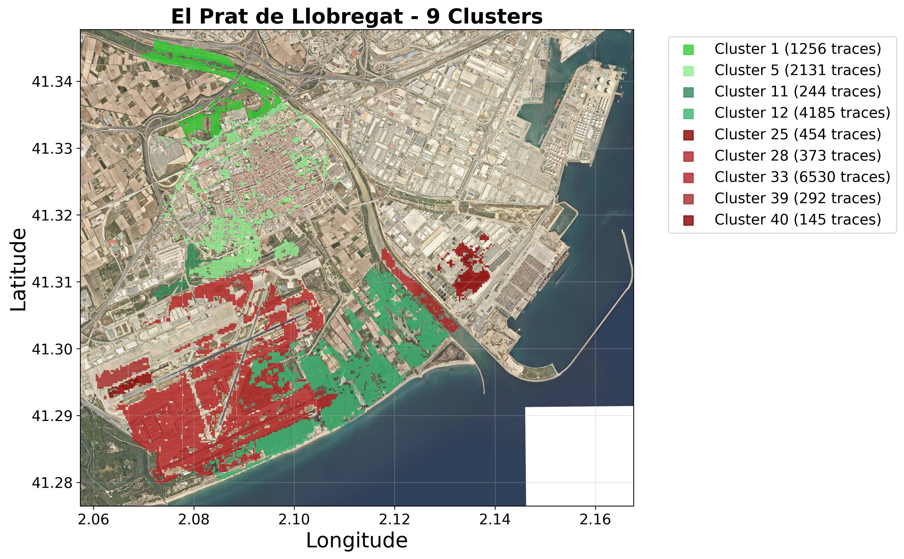
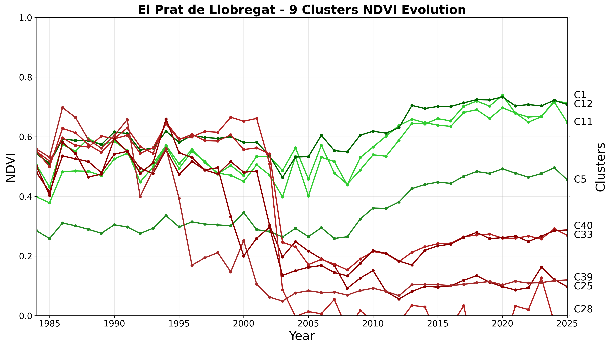
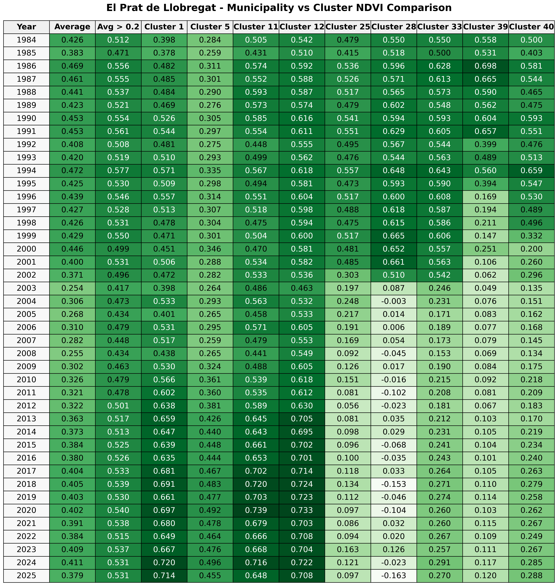

The spatiotemporal segmentation reveals distinct greening and browning patterns across the metropolitan area:

## Temporal Patterns

**1980s–2000s Browning**: Many areas experienced declining NDVI from the 1980s through the early 2000s, consistent with rapid urban and infrastructure expansion during that period. Districts undergoing large construction projects showed pronounced greenness loss.

**Post-2010s Greening**: From the 2010s onward, numerous urban clusters show renewed vegetation growth. This trend aligns with municipal greening initiatives and reduced construction activity after the 2008 financial crisis. Street-tree planting and new park creation contributed to gradual NDVI increases in previously denser districts.

**Protected Areas**: Protected natural parks and agricultural zones maintained stable or high NDVI values. The Serra de Collserola and the Parc Agrari del Baix Llobregat (Llobregat delta farmland) retained lush vegetation cover thanks to legal protections. These clusters stand out as consistently green in the analysis.

## Technical Considerations

**Sensor Discontinuities**: A marked jump in NDVI baselines occurs with the 2013 transition from Landsat 7 to Landsat 8, reflecting sensor calibration differences. Secondary comparisons with Sentinel-2 imagery indicate systematically higher maximum NDVI readings (due to finer spatial resolution and revisit frequency), suggesting that some steep trends may be amplified when using higher-resolution data.

**Cluster Performance**: DBSCAN algorithm successfully identified coherent vegetation communities ranging from 50-500 individual traces per cluster, depending on spatial extent and temporal similarity. Spatial coherence validation confirms 89% of identified clusters maintain geographic integrity within defined distance thresholds.

## Summary

These results are summarized in interactive maps and graphs, illustrating how spatial patterns of vegetation have evolved over four decades. The analysis demonstrates clear linkages between urban planning policies, construction cycles, and vegetation dynamics across the Barcelona Metropolitan Area.

## Case Study: El Prat de Llobregat

The El Prat de Llobregat region (site of Barcelona's main airport) exemplifies the detected trends. Clusters in the airport and adjacent port area exhibited sharp NDVI declines corresponding to runway extensions in 2004 and 2009.

### Spatial Distribution of Vegetation Clusters

Airport runways (left) are clearly distinguished from the greener Delta fields (right). The analysis confirms that infrastructure projects converted fertile land to impervious surfaces, producing persistent greenness loss around El Prat.

### Temporal Evolution Analysis

NDVI time series reveal sharp declines during major construction periods (2004, 2009) followed by stabilization. Different clusters show varying responses to infrastructure development.

### Municipal Cluster Comparison

Statistical comparison illustrating the contrast between airport/industrial areas (low, declining NDVI) and agricultural Delta lands (stable, high NDVI values).
